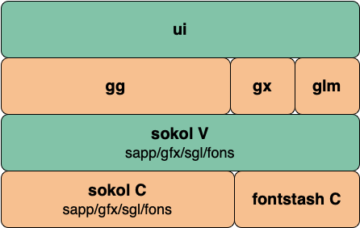

## UI模块

ui是V语言的标准ui库,基于sokol C图形库(以下简称sokol)创建

ui模块一开始是基于glfw模块,后来作者看到sokol的一些优秀特性,就决定改为基于sokol

### sokol介绍

sokol官方代码库及介绍:[https://github.com/floooh/sokol](https://github.com/floooh/sokol)

sokol演示项目:https://github.com/floooh/sokol-samples

sokol在线演示:https://floooh.github.io/sokol-html5/index.html

sokol优点:

- 跨平台,并且不同的平台可以使用对应平台的图形驱动,性能很好

  window使用DX11,mac使用metal,linux使用openGL

- 不仅仅是2D,3D绘图能力比较强

- 用C开发,只有单个头文件,简单,依赖少,易于集成,对V来说,更容易集成

- 生成的可执行文件很小,跟V语言的目标比较一致

- API简单,清晰

- 支持生成WebAssembly,可以快速在web上运行

sokol库更多内容可以参考[sokol图形库](sokol.md)章节

### ui模块安装

#### 安装依赖

ui依赖freetype和sokol,而sokol是单C文件,免安装,已内置在v/thirdparty/sokol中,所以要安装的依赖只有freetype:

```shell
macOS:
brew install freetype

Debian/Ubuntu:
sudo apt install libfreetype6-dev

Arch/Manjaro:
sudo pacman -S freetype2

Fedora:
sudo dnf install freetype-devel

ClearLinux:
sudo swupd bundle-add devpkg-libX11 devpkg-mesa devpkg-freetype

Windows:
v setup-freetype  
```


#### 安装ui

ui模块并不在vlib标准库中,是一个单独的代码库:https://github.com/vlang/ui

ui依赖的底层模块,位于vlib标准库中

目前ui还是早期版本,更新较快,建议直接使用源代码安装,可以随时用到最新的代码

1. 源码安装方式:

直接从git代码库下载代码,然后链接到~/.vmodules/ui,这样就可以在代码中直接import ui

```
git clone https://github.com/vlang/ui
ln -s /path/to/ui ~/.vmodules/ui
```

2. 使用vpm安装:


```
v install ui //安装ui
v update ui	//更新ui
```

### ui模块层级关系

以下图例描述了ui模块和标准库模块的关系




#### sokol模块

源代码位置:vlib/sokol

sokol模块,对sokol C的封装

sokol C源代码存放在thirdparty/sokol目录中

#### gg模块

源代码位置:vlib/gg

V绘图模块,用来在窗体上绘制各种图形

gg是general graphics的缩写

gg其实就是绘图部分的context,觉得可以直接命名为Context更好理解

gg结构体提供进行绘制的相关方法,给全局使用,特别是组件的draw()

gg.draw_triangle() //绘制三角形

gg.draw_triangle_tex() //绘制三角形纹理

gg.draw_rect()	//绘制实心矩形

gg.draw_empty_rect()	绘制空矩形

gg.draw_circle()	//绘制圆形

gg.draw_line()	//绘制直线

...还有好多绘制的功能没有实现

#### gx模块

源代码位置:vlib/gx

主要维护了颜色,文本,字体相关的基础结构体及常量

Color结构体

标准颜色的常量值

Image结构体

TextCfg结构体

#### glm模块

源代码位置:vlib/glm

OpenGL Mathematics（GLM） - 几何数学库

Math Libraries

OpenGl中在进行图形变换的时候需要使用几何数学库

矩阵变换，四元数，数据打包，随机数，噪声等等

代码:https://github.com/g-truc/glm

#### freetype模块

源代码位置:vlib/freetype

FreeType是一个完全开源的、可扩展、可定制且可移植的字体引擎，它提供TrueType字体驱动的实现统一的接口来访问多种字体格式文件

官网:https://www.freetype.org/

#### stbi模块

源代码位置:vlib/stbi

图像库

源代码:https://github.com/nothings/stb

### ui组件

基本的思路是:使用sokol的window,context,event,然后在窗体上自行绘制所有组件,可以在所有组件代码的draw()函数中看到自行绘制的代码

以window组件为例,显示通用的组件创建过程

1. 定义window结构体
2. 通过new_window(cfg WindowConfig) window 创建窗体,其中WindowConfig是配置类
3. 在每一个组件中定义draw()函数,包含绘制组件代码
4. 把每一个窗体内的组件都添加到window的children[]中
5. 使用window的ui,也就是UI结构体的实例来进行绘制
6. 最后调用ui.run(window &Window)函数,进入for{}无限循环,然后循环调用window中所有children[]中每一个组件的draw()函数,渲染组件,类似实时绘制的效果,最后调用window.ui.gg.run()函数,完成渲染,并监听事件

因为都是采用自行绘制的,所以

才有可能同一套UI代码,除了win,linux,mac外,以后也可以自行绘制成js前端组件,wasm组件,才有可能自行完全控制

才有可能实现响应式UI,监控代码修改,然后实时更新UI,类似swiftUI,响应式UI的实现也挺简单的,因为所有界面上的组件都是实时绘制的

也因为是采用自行绘制的,组件和组件的各种属性,方法,事件都要基于sokol重新定义

#### UI 结构体

UI结构体主要包含了:绘制图形和绘制文字的gg,系统剪贴板clipboard

window中的ui用来进行绘制图形,绘制文字,处理剪贴板

一般来说全局只有:1个sokol.window实例,1个ui.window实例,1个ui.UI实例

#### Widget 接口

所有的组件都实现了该接口

#### Layout接口


#### Window 窗体


#### Canvas 画布


#### Label 标签


#### Button 按钮


#### Textbox 文本框


#### Checkbox  复选框


#### Radio 单选框


#### Slider 滑竿


#### Dropdown 下拉菜单


#### Progressbar 进度条


#### Picture 图像


#### Menu 菜单


#### TransitionValue 动画


