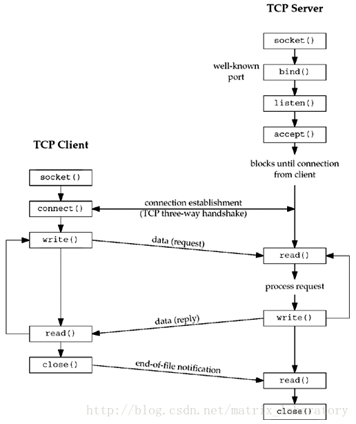

## net模块

### TCP

#### 客户端

```v
//客户端拨号
pub fn dial_tcp(address string) ?TcpConn
```

```v
//返回tcp连接
pub struct TcpConn { //实现io.Reader,io.Writer接口
pub:
	sock TcpSocket //Socket对象

mut:
	write_deadline time.Time
	read_deadline time.Time

	read_timeout time.Duration
	write_timeout time.Duration
}
```

```v
//tcp socket对象
struct TcpSocket {
pub:
	handle int //socket的文件描述符
}
```

客户端连接例子:

```v
module main

import net
import io

fn main() {
	mut client_conn := net.dial_tcp('baidu.com:80')?
	defer {
		client_conn.close()
	}
	client_conn.write_str('GET /index.html HTTP/1.0\r\n\r\n') ?
	client_conn.set_read_timeout(net.infinite_timeout)
	result := io.read_all(client_conn) ?
	println(result.bytestr())
}
```

#### 服务端

```v
//服务端启动监听
pub fn listen_tcp(port int) ?TcpListener
```

```v
//返回监听器/服务器对象
pub struct TcpListener {
	sock TcpSocket

mut:
	accept_timeout time.Duration
	accept_deadline time.Time
}
```

```v
//监听器/服务器对象,调用accept以后,开始监听,返回TcpConn对象
pub fn (l TcpListener) accept() ?TcpConn
```

服务端连接例子:

```v
module main

import net
import time

const (
	server_port = 22334
)

fn setup() (net.TcpListener, net.TcpConn, net.TcpConn) {
	listener := net.listen_tcp(server_port) or {
		panic(err)
	}
	mut client := net.dial_tcp('127.0.0.1:$server_port') or {
		panic(err)
	}
	client.set_read_timeout(3 * time.second)
	client.set_write_timeout(3 * time.second)
	mut server := listener.accept() or {
		panic(err)
	}
	server.set_read_timeout(3 * time.second)
	server.set_write_timeout(3 * time.second)
	return listener, client, server
}

fn cleanup(listener &net.TcpListener, client &net.TcpConn, server &net.TcpConn) {
	listener.close() or { }
	client.close() or { }
	server.close() or { }
}

fn main() {
	listener, client, server := setup()
	defer {
		cleanup(listener, client, server)
	}
	message := 'Hello World'
	//server
	server.write_str(message) ?
	println('message send: $message')
	println('server socket: $server.sock.handle')
	//client
	mut buf := []byte{len: 1024}
	nbytes := client.read(mut buf) ?
	received := buf[0..nbytes].bytestr()
	println('message received: $received')
	println('client socket: $client.sock.handle')
}
```

### UDP

实现思路基本跟TCP一致

#### 客户端

```v
//客户端拨号
pub fn dial_udp(laddr string, raddr string) ?UdpConn
```

```v
//返回udp连接
pub struct UdpConn { //实现io.Reader,io.Writer接口
	sock UdpSocket //Socket对象

mut:
	write_deadline time.Time
	read_deadline time.Time

	read_timeout time.Duration
	write_timeout time.Duration
}
```

```v
//udp socket对象
struct UdpSocket {
	handle int //socket的文件描述符

	l Addr //local addr
	r ?Addr //remote addr
}
```

#### 服务端

```v
//服务端启动监听,返回udp连接,udp不需要accept,直接开始
pub fn listen_udp(port int) ?UdpConn
```

服务端连接例子:

```v
import net
import time

fn echo_server(_c net.UdpConn) {
	mut c := _c
	c.set_read_timeout(10 * time.second)
	c.set_write_timeout(10 * time.second)
	for { //无限循环监听,接收数据后,原样返回给客户端
		mut buf := []byte{len: 100, init: 0}
		read, addr := c.read(mut buf) or {
			continue
		}
		c.write_to(addr, buf[..read]) or {
			println('Server: connection dropped')
			return
		}
	}
}

fn echo() ? {
  //客户端拨号
	mut c := net.dial_udp('127.0.0.1:40003', '127.0.0.1:40001') ?
	defer {
		c.close() or { }
	}
	c.set_read_timeout(10 * time.second)
	c.set_write_timeout(10 * time.second)
	data := 'Hello from vlib/net!'
	c.write_str(data) ?
	mut buf := []byte{len: 100, init: 0}
	read, addr := c.read(mut buf) ?
	assert read == data.len
	println('Got address $addr')
	for i := 0; i < read; i++ {
		assert buf[i] == data[i]
	}
	println('Got "$buf.bytestr()"')
	c.close() ?
	return none
}

fn test_udp() {
	l := net.listen_udp(40001) or { //服务端启动udp监听
		println(err)
		panic('')
	}
	go echo_server(l)
	echo() or {
		println(err)
	}
	l.close() or { }
}

fn main() {
	test_udp()
}

```


### TCP网络连接图



---


